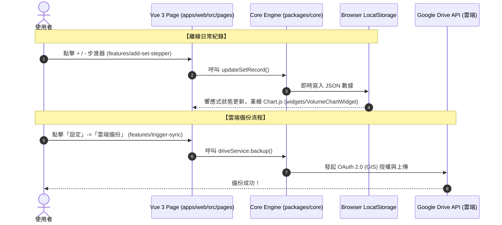

# forge-fit 專案規劃藍圖 (Project Blueprint)

本藍圖已根據討論共識進行全面升級，確認採用現代化、模組化且高度工程化的開發架構：**「pnpm Monorepo + Turborepo + Vue 3 + Vite + TypeScript」**，並在前端應用中嚴格導入 **「Feature-Sliced Design (FSD)」** 代碼目錄組織規範。

此架構不僅能實現 **100% 離線優先 PWA** 與 **Google Drive 雲端備份**，還能透過 FSD 的嚴謹分層與單向依賴原則，提供極致的前端可讀性、組件高複用度以及型別安全保護。

---

## 一、 專案願景與核心定位 (已確認)
* **專案名稱**：`forge-fit` (鍛造健身)
* **核心標語**：*Forge Your Body, Track Your Progress, Architected with FSD.*
* **核心價值**：
  * **PWA 本地優先 (Offline-First)**：所有訓練日誌與器材數據即時讀寫於本機 `LocalStorage` / `IndexedDB`，無訊號地下室健身房秒開使用。
  * **Google Drive 雲端自建備份 (Privacy-First Sync)**：使用者透過 Google OAuth 2.0 登入自己擁有的 Google 帳號，並將數據備份至自己雲端硬碟的專屬 `forge_fit_backup.json` 檔案中。
  * **人類化可讀架構 (Feature-Sliced Design)**：前端採用 FSD 規範，層次分明、單向依賴，徹底杜絕程式碼糾纏與混亂。
  * **Monorepo 多套件管理**：使用 `pnpm workspaces` 與 `Turborepo` 管理，將核心資料庫與 API 服務 (`packages/core`) 抽離，便於未來隨時擴充至其他平台。

---

## 二、 UI/UX 視覺與互動規範 (藍色調暗黑科技風)

視覺風格確認採用**「深靛藍/曜石黑」**背景，搭配發光的**「極光青」**與**「皇家藍」**霓虹點綴，營造極具專注感的科幻運動氛圍。

### 1. 色彩系統 (Color Tokens)
* **背景深色系**：
  * 主背景：`#080A10` (極深邃藍黑)
  * 面板與卡片背景：`rgba(18, 22, 36, 0.65)` (搭配毛玻璃 `backdrop-filter: blur(16px)` 特效)
* **霓虹發光色系**：
  * 極光青 (Neon Cyan)：`#00F0FF` (用於重點進度、核取狀態、PR 慶祝、選中導覽)
  * 科技皇家藍 (Royal Blue)：`#2F80ED` (用於主要按鈕、一般進度條、圖表主色)
* **狀態與中性色**：
  * 成功綠色：`#00FF87` (用於狀態標籤，具呼吸燈效果)
  * 警告紅色：`#FF4A4A` (用於刪除、重置)
  * 文字主色/次色：`#E2E8F0` (冰冷白) / `#94A3B8` (冷灰色)

### 2. 手機版觸控與 PWA 介面優化
* **底部固定導覽列 (Bottom Nav Bar)**：提供「看板」、「重量紀錄」、「動作庫」與全新的「設定備份 (Settings)」頁面。
* **觸控步進器 (Stepper Input)**：重量點擊 `+` / `-` 增減 `2.5 kg`；次數點擊 `+` / `-` 增減 `1 reps`，避免虛擬鍵盤干擾。

---

## 三、 Monorepo 與 Feature-Sliced Design (FSD) 目錄結構

專案在**宏觀 (Monorepo)** 上切分核心邏輯與應用，在**微觀 (FSD)** 上切分前端功能模組。

### 1. 整體專案目錄結構
```text
forge-fit/
├── apps/
│   └── web/                   # Vue 3 + Vite + TypeScript PWA 主應用程式 (FSD 規範)
│       ├── src/
│       │   ├── app/           # 1. 全局初始化 (樣式、PWA 註冊、Pinia)
│       │   ├── pages/         # 2. 獨立分頁 (DashboardPage, LoggerPage, LibraryPage, SettingsPage)
│       │   ├── widgets/       # 3. 大型高複用區塊 (VolumeChartWidget, WorkoutLoggerCard)
│       │   ├── features/      # 4. 行動/功能層 (add-set-stepper, auth-by-google, trigger-sync)
│       │   ├── entities/      # 5. 業務領域實體 (workout-session, exercise, user-profile)
│       │   └── shared/        # 6. 公共複用層 (ui-kit 按鈕、api 客戶端、utils 工具)
│       ├── index.html
│       ├── vite.config.ts
│       └── public/            # manifest.json、logo.svg、sw.js 離線引擎
├── packages/
│   ├── core/                  # 核心數據處理包 (跨平台共享)
│   │   ├── src/
│   │   │   ├── db/            # LocalStorage / IndexedDB 資料庫封裝
│   │   │   ├── drive/         # Google Drive API 串接與備份邏輯
│   │   │   └── index.ts       # 導出核心服務
│   │   └── package.json
│   └── types/                 # 統一的 TypeScript 型別定義
│       ├── index.d.ts
│       └── package.json
├── package.json               # Monorepo 根目錄配置
├── pnpm-workspace.yaml        # pnpm 工作區設定
├── turbo.json                 # Turborepo 構建管線與快取設定
└── README.md                  # 本專案規劃藍圖
```

### 2. FSD 核心依賴原則 (Unidirectional Dependencies)
FSD 嚴格要求代碼依賴必須是**單向且由上至下**的，高層級（如 `pages`）可以引入低層級（如 `features`, `entities`），但低層級**絕對不能**逆向引入高層級代碼，以此保證模組極高的獨立性與可測試性。

---

## 四、 雲端備份與同步架構 (Data Sync Architecture)



---

## 五、 技術選型決策 (已確認)
* **套件與工作區管理**：
  * **pnpm (工作區)**：管理多專案相依性，極速且節省硬碟空間。
  * **Turborepo**：建構高速管線，支援快取 (caching) 機制，加速 build 與 dev。
* **前端框架與架構**：
  * **Vue 3 (Composition API / `<script setup>`)**：極具人類可讀性的響應式開發體驗，邏輯抽離度高。
  * **Vite**：極速的開發伺服器與靜態打包工具。
  * **TypeScript**：提供完美的型別提示，預防資料讀寫時的欄位名稱錯誤。
  * **Feature-Sliced Design (FSD)**：前端代碼結構組織學。
* **資料庫與備份引擎**：
  * **LocalStorage / IndexedDB**：本機持久化資料庫。
  * **Google Identity Services (GIS) & Google Drive API**：處理 OAuth 2.0 登入與檔案同步備份。

---

## 六、 推薦開發路徑 (Roadmap)

1. **Step 1: 初始化 Monorepo 骨架 [進行中]**
   * 建立 `pnpm-workspace.yaml`、`turbo.json`、根目錄 `package.json`。
   * 初始化 `packages/types`、`packages/core` 與 `apps/web` 骨架資料夾。
2. **Step 2: 在 `apps/web` 中初始化 Vue 3 + TS 專案並建置 FSD 目錄 [待進行]**
   * 使用 Vite 初始化專案，建立 FSD 的 `app`, `pages`, `widgets`, `features`, `entities`, `shared` 六大目錄。
   * 移植視覺樣式 (`style.css`, `logo.svg`, PWA manifest 等)。
3. **Step 3: packages/core 資料庫持久化與業務抽離 [待進行]**
   * 將日常重量數據讀寫、計算法則寫在 `packages/core`，並在 `apps/web/src/entities` 中進行引用。
4. **Step 4: Google Drive API 備份模組實作與設定分頁開發 [待進行]**
   * 實作 `trigger-sync` 功能，串接 `GIS` 帳號綁定，完成雲端備份。
5. **Step 5: PR 突破紀錄與歷史成長圖表擴充 [待進行]**
   * 擴充動作極限與折線圖歷史追蹤。
